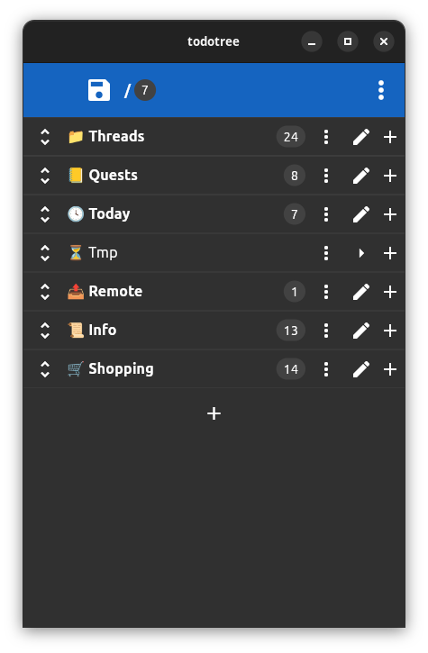
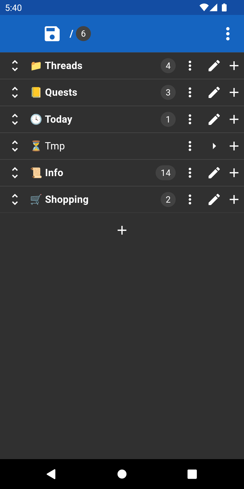

# ToDo Tree

ToDo notes in an unlimited tree structure. Written in Flutter.
For Android, iOS and Linux.

<div align="center">
  
</div>

<div align="center">
    <a href="https://github.com/igrek51/todotree2">GitHub</a>
    -
    <a href="https://play.google.com/store/apps/details?id=dev.igrek.todotree.v2">Google Play</a>
</div>

## Running
### Run desktop Linux app
```sh
make run-linux
```



### Run on Android device
```sh
make run-release
```



or install it from Google Play:

<a href='https://play.google.com/store/apps/details?id=dev.igrek.todotree.v2&pcampaignid=pcampaignidMKT-Other-global-all-co-prtnr-py-PartBadge-Mar2515-1' target="_blank" rel="noopener noreferrer">
    
</a>