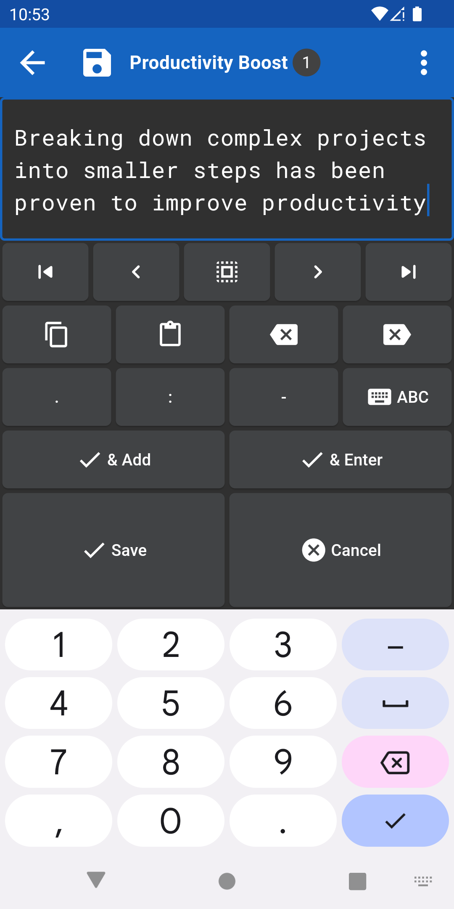
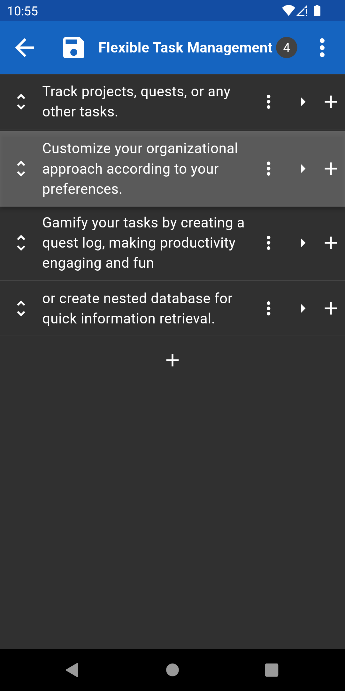

# ToDo Tree

To-do tasks in a nested tree structure. Written in Flutter.
For Android, iOS and Linux.

<div align="center">
  
</div>

<div align="center">
    <a href="https://github.com/igrek51/todotree2">GitHub</a>
    -
    <a href="https://play.google.com/store/apps/details?id=dev.igrek.todotree.v2">Google Play</a>
    -
    <a href="https://github.com/igrek51/todotree2/releases/latest">Latest Release</a>
</div>

## Running from source
### Run desktop app on Linux
```sh
make run-linux
```


### Run on Android device
```sh
make run-release
```

<div align="center">
  
  
  
  
</div>

## Install to Android
### Install from Google Play
You can install it from Google Play:

<a href='https://play.google.com/store/apps/details?id=dev.igrek.todotree.v2&pcampaignid=pcampaignidMKT-Other-global-all-co-prtnr-py-PartBadge-Mar2515-1' target="_blank" rel="noopener noreferrer">
    
</a>

### Install from APK
Alternatively, install APK file found in the
[latest release](https://github.com/igrek51/todotree2/releases/latest).

## Features

- **Nested Folders**:
  Organize your tasks in a nested, unlimited tree structure.
- **Productivity Boost**:
  Breaking down complex projects into smaller steps has been proven to improve productivity.
- **Flexible Task Management**:
  Track projects, quests, or any other tasks.
  Customize your organizational approach according to your preferences.
  Gamify your tasks by creating a quest log, making productivity engaging and fun
  or create nested database for quick information retrieval.
- **Intuitive Drag-and-Drop**:
  Easily rearrange tasks.
- **Batch Operations**:
  Efficiently manage multiple items at once by selecting, moving, or editing them in batches
- **Links**:
  Create shortcuts to swiftly navigate between different sections or tasks.
- **Daily Backups**:
  Restore your valuable data with ease by going back in time.
- **External Backup Support**:
  Store backups in external locations, providing extra layer of security.
- **Efficiency and Speed**:
  Smooth and rapid user experience and blazing fast performance
